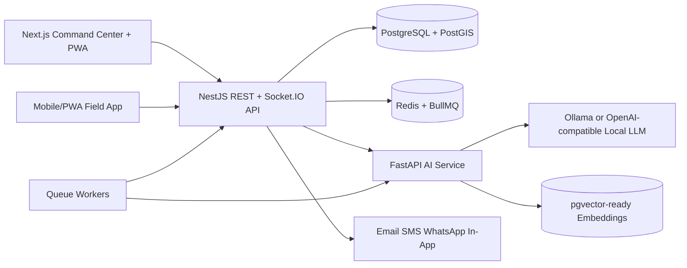

# Political Intelligence Operating System Architecture

## Product Scope

PIOS is a multi-tenant political intelligence and campaign analytics platform for African campaign environments. The MVP implemented in this repository focuses on the first operational slice:

- campaign command center metrics
- tenant-aware authentication and RBAC foundations
- GIS-ready regional intelligence
- mobile field intelligence reports
- social listening and narrative scoring
- AI-generated recommendations and executive briefings
- alert delivery model
- production deployment scaffolding

## System Architecture

## Monorepo Layout

- `apps/web`: Next.js App Router frontend, Tailwind, command-center UI, PWA-ready shell.
- `apps/api`: NestJS backend with modular REST APIs, Socket.IO gateway, RBAC guards, and Prisma access.
- `services/ai`: FastAPI intelligence microservice with sentiment, clustering, recommendations, and briefing endpoints.
- `packages/database`: Prisma schema and seed data for PostgreSQL/PostGIS.
- `packages/shared`: Shared TypeScript types used by web and API.
- `docker-compose.yml`: local Postgres/PostGIS, Redis, Ollama, API, web, and AI service.

## Tenancy and Security Model

All campaign-owned records include `tenantId`. API requests resolve tenant context from the authenticated user and optional tenant header for super-admin use. RBAC is role based with granular permissions for command, analytics, field, CRM, surveys, media, AI, and administration.

Security controls included in the design:

- JWT access tokens with MFA-ready user fields
- tenant-scoped Prisma query patterns
- audit log table for sensitive changes
- API throttling-ready Nest module configuration
- secure upload metadata table for external object storage
- session and device tracking schema
- immutable intelligence insight history

## Data Pipeline

1. Ingest field reports, surveys, media posts, radio transcripts, and CRM updates.
2. Normalize and enrich data with tenant, campaign, geography, source, and confidence metadata.
3. Queue NLP jobs through Redis/BullMQ.
4. AI service scores sentiment, extracts topics, embeds text, clusters narratives, and returns recommendations.
5. API persists AI insights, emits WebSocket updates, and creates alerts when thresholds are crossed.
6. Dashboard queries cached aggregate endpoints for fast command-center reads.

## MVP Boundaries

This repository provides real implementation code for the platform foundation and a representative vertical slice. External integrations such as WhatsApp Business, SMS providers, X/Twitter, Facebook, TikTok, and payment rails are represented by stable adapter interfaces and production-oriented schemas so they can be connected without changing core domains.

## Scalability Roadmap

1. Split queue workers from the API process and add per-tenant queue priorities.
2. Add read replicas and materialized views for high-volume dashboard analytics.
3. Add pgvector or a dedicated vector store for large-scale narrative search.
4. Add offline sync conflict resolution for the field PWA and React Native app.
5. Add country-specific electoral boundary imports and PostGIS topology validation.
6. Add model registry, evaluation traces, and per-tenant AI policy configuration.
7. Add SOC2-style evidence collection, key rotation, and customer-managed encryption.
